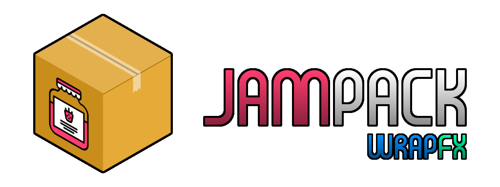

<div align="center">



</div>

**NOTE:** JamPack is currently being made as a highschooler's hobby project. Suggestions are very much appreciated!

&nbsp;&nbsp;&nbsp;&nbsp;
JamPack is a lightweight, asynchronous and extensible asset framework made for use in games and apps. By default, it doesn't come with any encoders or decoders, but it's easy to make your own!

&nbsp;&nbsp;&nbsp;&nbsp;
To decode assets at runtime, you can open a jar, which you can unpack in order to receive it's raw asset data.

```Rust
fn main() {
    let my_asset = jampack::jar("res/image")
        .unwrap();
    let data = my_asset.unpack();
}
```

&nbsp;&nbsp;&nbsp;&nbsp;
If the data type you want to decode implements the ```Jam``` trait, it can be done automatically!

```Rust
use jampack::Jam;
fn main() {
    let my_asset = jampack::open<MyType>("res/my_asset")
        .unwrap();
}

struct MyType {}
impl Jam for MyType {
    fn unjar(ty: u8, data: Vec<u8>) -> jampack::Result<Self> {
        Ok(MyType {})
    }
}
```

&nbsp;&nbsp;&nbsp;&nbsp;
Encoding data is done using a stove, which uses recipes in order to cook asset files. If the original asset hasn't been modified, it will skip it. It will also automatically remove deleted files.

&nbsp;&nbsp;&nbsp;&nbsp;
The recommended use of a stove is in build scripts.

```Rust
// build.rs
const INPUT_DIR: &str = "./res-src";
const OUT_DIR: &str   = "./res";

fn main() {
    let stove = jampack::Stove::new()
        .unwrap()
        .with_recipe(passthrough_recipe());
    
    stove.cook(INPUT_DIR, OUT_DIR);
}

fn passthrough_recipe() -> jampack::Recipe {
    fn bake(data: Vec<u8>) -> jampack::Jar {
        jampack::Jar::new(128, 0, data)
    }
    jampack::Recipe::new(bake, vec!["bin"])
}
```

<div align="center">

**Legal**

Original jam icon used in JamPack logo made by lastspark from the Noun Project (licensed under CCBY 3.0 license)

</div>